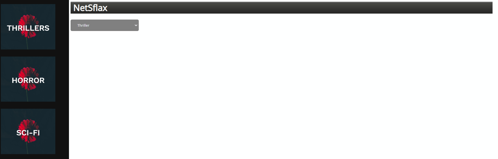
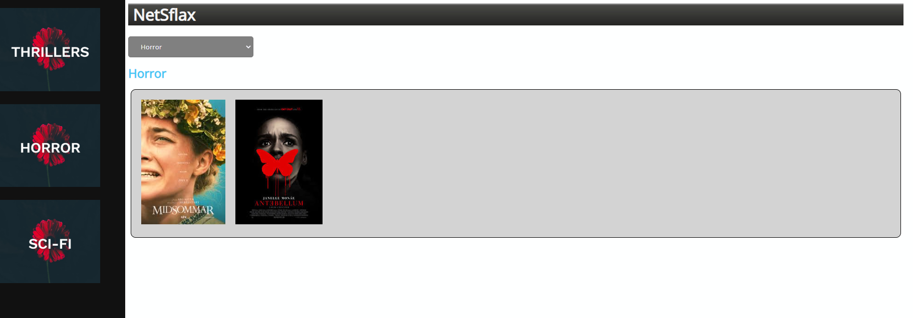
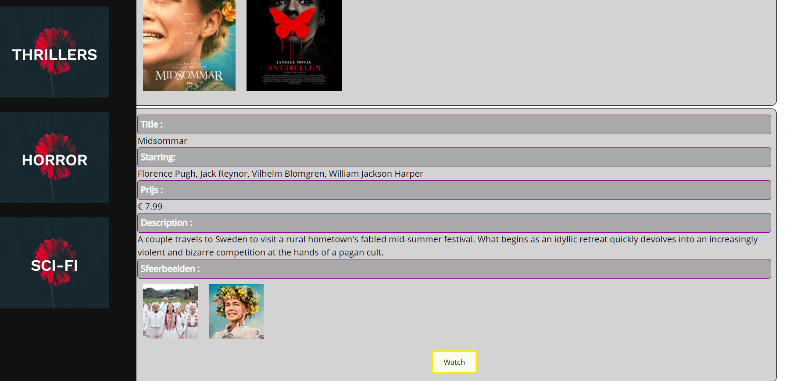
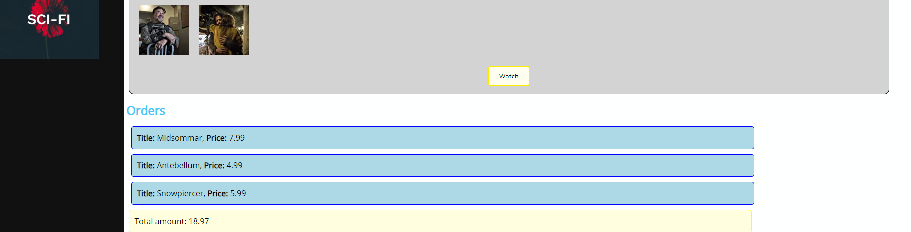

# Eindevaluatie Web Frontend Advanced
Dit examen maakt 50% uit van de evaluatie van de module Web Frontend Advanced.
Lees aandachtig de opgave bij de start van het examen.

## Algemene richtlijnen
* Het examen is **open boek**, dit betekent dat je de volledige cursus kan gebruiken, alsook alle oefeningen die tijdens de lessenreeks werden gebruikt.
* Iedere vorm van samenwerking is **niet** toegelaten.

## Opgave
* Vervolledig de meegeleverde webpagina aan de hand van de bijgeleverde .js/.json datafile, deze datafile mag niet worden aangepast.
* Bij het inladen van de pagina worden in het select element de genres van movies opgevuld. De genres worden ook weergegeven in het linkerpaneel aan de hand van hun bijhorende images.
* Bij het selecteren van een genre krijgt de gebruiker de bijhorende movies te zien.
* Wanneer vervolgens een movie aangeklikt wordt krijgt de gebruiker onderstaande info te zien
  * Title van de movie
  * De acteurs
  * Prijs om te huren
  * Description
  * DetailFoto('s)

* Wanneer de gebruiker een movie aankoopt via de daartoe voorziene knop wordt deze aankoop onderaan de pagina weergegeven en wordt tevens **de totaalprijs** van de aankopen berekend tot 2 cijfers na de komma. Een movie kan uiteraard maar 1 keer aangekocht worden om te streamen.

* Voorzie zelf met behulp van een extra css-file een opmaak voor de uitwerking.
### Zorg voor regelmatige commits na elk stukje functionaliteit. Bij minder dan 2 commits per uur gaan we ervan uit dat er fraude in het spel is!!

### Iedere vaststelling van onregelmatigheid wordt conform het OER gemeld aan de betrokken student en de voorzitter van de examencomissie. 

## Voorbeeld (GUI kan naar eigen smaak worden aangepast)
### StartSituatie

### GenreKeuze

### FilmDetails

### Bestellingen

